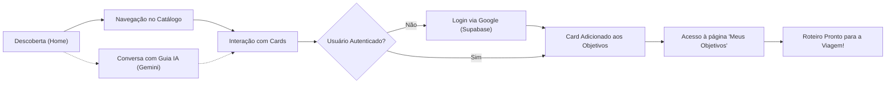

# Product Requirements Document (PRD) — Tripadinho

**Versão:** 1.0  
**Data:** Setembro de 2026  
**Status:** Aprovado  
**Autor:** Equipe de Produto & Engenharia Tripadinho  

---

## 1. Visão Geral e Resumo Executivo

O **Tripadinho** é o portal definitivo de turismo inteligente focado com exclusividade nas 9 capitais e principais destinos turísticos do **Nordeste brasileiro** (*Salvador, Recife, Fortaleza, Natal, João Pessoa, Maceió, Aracaju, São Luís e Teresina*).

Diferente de plataformas generalistas de viagem que sobrecarregam o turista com excesso de avaliações dispersas e informações desatualizadas, o Tripadinho entrega um formato limpo e orientado à ação: **Cards de Experiências** (Passeios, Restaurantes e Locais) curados continuamente por **Agentes de Inteligência Artificial autônomos (Google ADK & Gemini 3.6 Flash)**, permitindo ao usuário planejar e gerenciar sua viagem com um clique através da funcionalidade **"Meus Objetivos"**.

---

## 2. Declaração do Problema (Problem Statement)

1. **Fragmentação de Informações:** Planejar uma viagem para o Nordeste exige consultar múltiplos blogs, Instagrams, guias estáticos e buscadores genéricos.
2. **Falta de Foco Regional:** Plataformas globais priorizam grandes redes hoteleiras e ignoram experiências culturais autênticas, a gastronomia típica e passeios regionais singulares.
3. **Sobrecarga de Escolha (Analysis Paralysis):** O turista se perde entre centenas de opções sem saber quais realmente combinam com seu tempo de estadia e estilo.
4. **Dificuldade de Organização:** Salvar dicas em capturas de tela ou notas de celular dificulta a execução prática do roteiro no momento da viagem.

---

## 3. Objetivos Estratégicos de Negócio

| Objetivo | Descrição | Meta de Impacto |
| :--- | :--- | :--- |
| **Autoridade Regional** | Tornar-se o portal de referência número 1 para turismo nas 9 capitais nordestinas. | Conquistar +100 mil visitantes únicos/mês no primeiro ano. |
| **Engajamento Ativo** | Estimular a interação com experiências através de salvamento de cards e uso de IA. | Média de ≥ 5 experiências salvas por usuário ativo. |
| **Conversão de Usuários** | Fidelizar usuários através de autenticação simplificada (Google OAuth/Supabase). | Taxa de conversão de visitantes para cadastrados ≥ 15%. |
| **Monetização Futura** | Estabelecer parcerias com o ecossistema local (receptivos, restaurantes e atrações). | Gerar receita por comissões de reservas e posicionamentos em destaque. |

---

## 4. Público-Alvo e Personas

### Persona 1: Juliana, a Viajante Independente (28 anos)
- **Perfil:** Profissional de tecnologia, viaja sozinha ou com amigos.
- **Dores:** Não quer roteiros "turistão", busca restaurantes autênticos e praias menos óbvias; odeia perder horas lendo dezenas de páginas.
- **Necessidade no Tripadinho:** Quer cards rápidos, fotos atraentes e a capacidade de salvar em "Meus Objetivos" para ter o roteiro no celular.

### Persona 2: Marcos e Renata, o Casal em Férias (38 e 36 anos)
- **Perfil:** Casal com filhos pequenos planejando férias no Nordeste.
- **Dores:** Incerteza sobre quais praias e passeios oferecem segurança e boa estrutura familiar.
- **Necessidade no Tripadinho:** Usa o **Guia Virtual com IA** para pedir dicas específicas ("*quais os melhores passeios com crianças em Maceió?*") e salva as sugestões no perfil.

---

## 5. Proposta de Valor e Diferenciais Competitivos

1. **Hiperfoco 100% Nordeste:** Conhecimento profundo da cultura, sazonalidade, culinária e geografia de cada uma das capitais nordestinas.
2. **Curadoria com Agentes Autônomos (Google ADK):** Experiências pesquisadas, validadas e atualizadas continuamente no banco de dados por inteligência artificial de ponta.
3. **Formato em Cards Acionáveis:** Cada card representa uma experiência concreta (não apenas um ponto no mapa), contendo foto de alta qualidade, categoria (Passeio, Restaurante, Local), descrição envolvente e ação imediata de salvar/remover.
4. **Planejador "Meus Objetivos":** Espaço visual onde o viajante consolida sua lista de metas de viagem por cidade, transformando ideias soltas em um roteiro executável.
5. **Design Clean e Temático:** Interface inspirada nos tons claros, areia e mar do litoral nordestino, com animações suaves e alta performance mobile.

---

## 6. Módulos e Funcionalidades do Produto

### 6.1. Landing Page Interativa (`index.html`)
- **Hero Dinâmico:** Fundo com transições fluidas de fotos paradisíacas e headline atrativa.
- **Carrossel de Destinos Conectado ao Supabase:** Leitura em tempo real das capitais com fotos, estados e contagem de experiências.
- **Chamada de IA Integrada:** Apresentação do assistente virtual para quebrar a barreira de entrada do usuário.

### 6.2. Catálogo de Destinos & Experiências (`destination.html`)
- **Filtros por Capital:** Navegação fluida pelas 9 capitais (*Salvador, Recife, Fortaleza, Natal, João Pessoa, Maceió, Aracaju, São Luís e Teresina*).
- **Filtros de Categoria:** Classificação visual entre **Passeios** (ícone/cor esmeralda), **Restaurantes** (âmbar) e **Locais** (índigo).
- **Ação Rápida de Salvar/Remover:** Botão com estado reativo (*"+ Salvar em Meus Objetivos"* ou *"Remover dos Objetivos"*) com notificações flutuantes imediatas (*Toasts*).

### 6.3. Painel "Meus Objetivos" (`objectives.html`)
- **Dashboard de Metas:** Contadores de experiências e destinos salvos.
- **Agrupamento por Destino:** Visualização das experiências selecionadas para cada cidade.
- **Gestão de Itens:** Permite desmarcar/remover cards diretamente com remoção imediata no banco de dados e na interface.
- **Empty State Construtivo:** Orientação visual para o catálogo quando não houver experiências salvas.

### 6.4. Guia Virtual Conversacional (Deep Research & Function Calling)
- **Assistente Integrado:** Flutuante em todas as páginas, alimentado pelo modelo **Gemini 3.6 Flash**.
- **Tool Calling (`search_places`):** IA capaz de pesquisar no banco de dados e sugerir cartões interativos diretamente dentro da conversa do chat.

### 6.5. Agente Curador em Background (`adk_agent/`)
- **Framework Google ADK:** Agente autônomo responsável por pesquisar as melhores atrações na internet, estruturar o JSON e salvar no banco de dados PostgreSQL (Supabase), além de manter a documentação Markdown (`curated_experiences_adk.md`).

---

## 7. Jornada do Usuário (User Journey)

---

## 8. Métricas de Sucesso e KPIs

| Categoria | Métrica (KPI) | Descrição / Meta |
| :--- | :--- | :--- |
| **Aquisição** | Visitantes Únicos | Crescimento de 20% mês a mês nos primeiros 6 meses. |
| **Ativação** | Taxa de Cadastro / Login | % de visitantes que realizam login para salvar o primeiro card. |
| **Engajamento** | Cards Salvos por Usuário | Média ideal: ≥ 6 cards (equivalente a 1 roteiro completo de fim de semana). |
| **Uso da IA** | Sessões de Chat com a IA | % de usuários que abrem o Guia Virtual e recebem recomendações. |
| **Retenção** | Retorno à página "Meus Objetivos" | Usuários que voltam à plataforma durante os dias que antecedem a viagem. |

---

## 9. Modelo de Negócio e Monetização

1. **Comissão de Afiliados (Afiliados de Experiências):**
   - Integração de botões de reserva ("Reservar Passeio" ou "Comprar Ingresso") redirecionando para operadoras locais de turismo (receptivos) com comissão por transação (take rate de 8% a 15%).
2. **Destaque Patrocinado de Restaurantes & Atrações:**
   - Restaurantes e estabelecimentos típicos do Nordeste poderão contratar destaque prioritário nos filtros e recomendações do chat.
3. **Tripadinho Pro (Assinatura / Roteiro Sob Medida):**
   - Exportação do roteiro completo em PDF interativo, mapas offline no Google Maps e suporte via WhatsApp para reservas.

---

## 10. Roadmap de Evolução

- [x] **Fase 1 (MVP Atualizado - Concluído):**
  - Catálogo das 9 capitais integrado ao Supabase.
  - Agente Curador autônomo com Google ADK.
  - Chat conversacional inteligente (Gemini 3.6 Flash) com tool calling.
  - Sistema de Contas Seguro (Supabase Auth - JWT, E-mail/Senha e Login Social com Google).
  - Página dedicada "Meus Objetivos" protegida por sessão.
  - Página "Meu Perfil" com opção de Exclusão Definitiva de Conta.
  - Deploy em Nuvem Serverless (Google Cloud Run) num contêiner único.
- [ ] **Fase 2 (Próximos Passos):**
  - Estimativa de custos e orçamentos em "Meus Objetivos" (calculadora de viagem).
  - Exportação do roteiro salvo para calendário (Google Calendar / iCal) e WhatsApp.
  - Expansão para destinos litorâneos e interioranos não capitais (ex: Pipa, Jericoacoara, Porto de Galinhas, Lençóis Maranhenses).
- [ ] **Fase 3 (Expansão e Marketplace):**
  - Integração de pagamentos para reserva direta de passeios e transfers.
  - Aplicativo móvel (PWA ou nativo iOS/Android).
